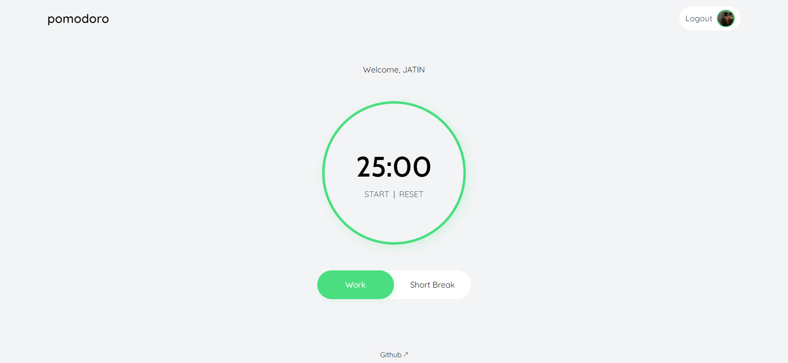

# Pomodoro-App-With-Google-Authentication

## Overview
The Pomodoro Timer App is a productivity tool that helps you manage your work and break intervals efficiently. The app follows the Pomodoro Technique, a time management method that encourages working in focused, timed intervals with short breaks in between.

## Features
- User Authentication: Sign in with your Google account for a personalized experience.

- Timer: A 25-minute timer for focused work, followed by a 5-minute break timer.


## Technologies
- React: The app is built with React for a dynamic and responsive user interface.

- Firebase: Firebase is used for user authentication.

- Tailwind CSS: Tailwind CSS is used for quick and easy styling.

## Setup
1. Clone the repository:
```git clone https://github.com/yourusername/pomodoro-app.git```

3. Navigate to the project folder:
```cd pomodoro-app```

4. Install dependencies:
```npm install```

5. Create a .env file with your Firebase configuration:
```REACT_APP_FIREBASE_API_KEY, REACT_APP_FIREBASE_AUTH_DOMAIN, REACT_APP_FIREBASE_PROJECT_ID, REACT_APP_FIREBASE_STORAGE_BUCKET, REACT_APP_FIREBASE_MESSAGING_SENDER_ID, REACT_APP_FIREBASE_APP_ID```

6.Start the development server:
```npm start```

7. Open your browser and go to http://localhost:3000.

## Usage

1. Sign in with your Google account.
2. Start the Pomodoro timer for focused work.
3. After 25 minutes, the app will play a beep.
